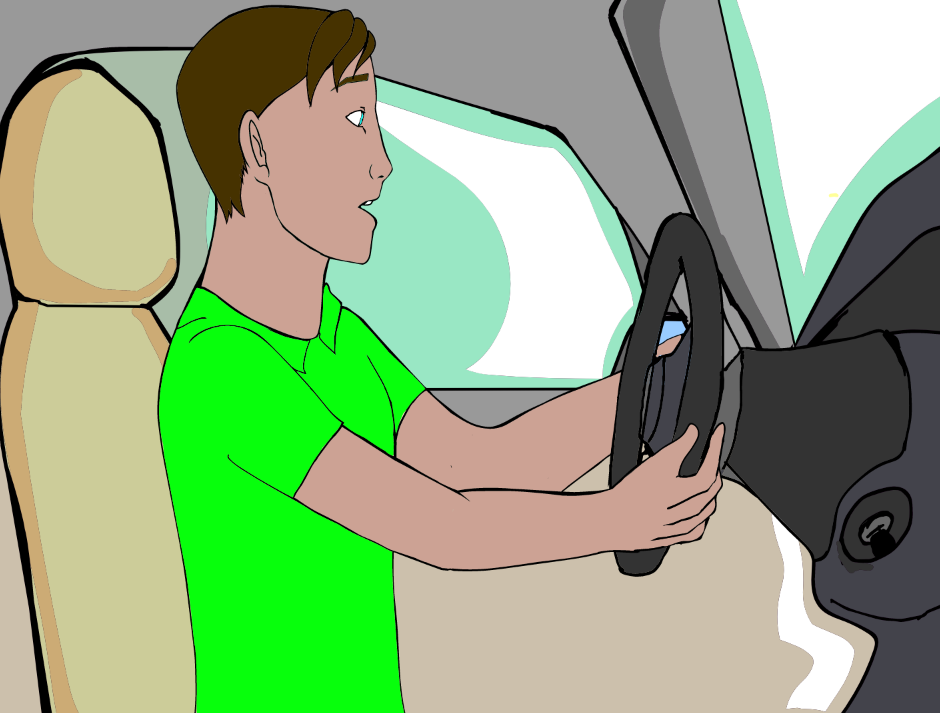
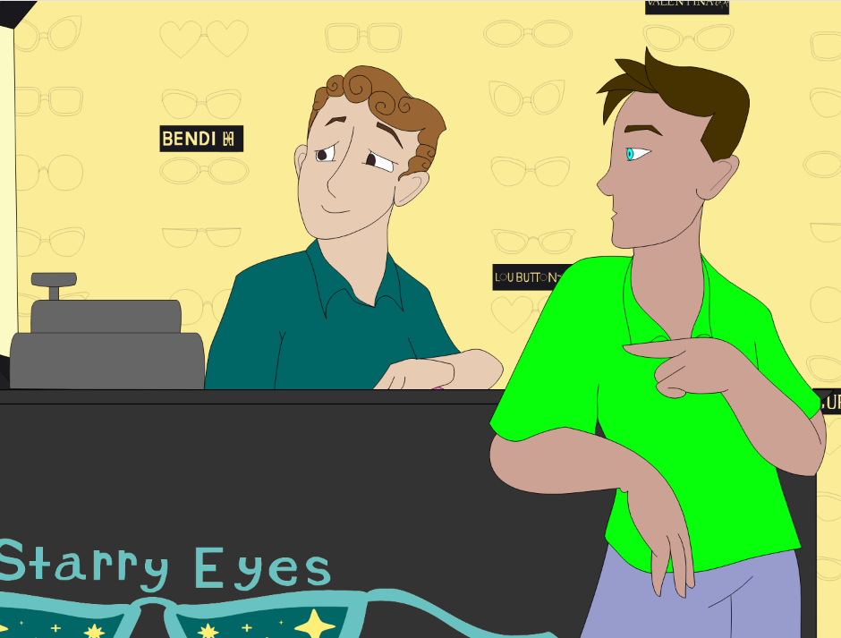
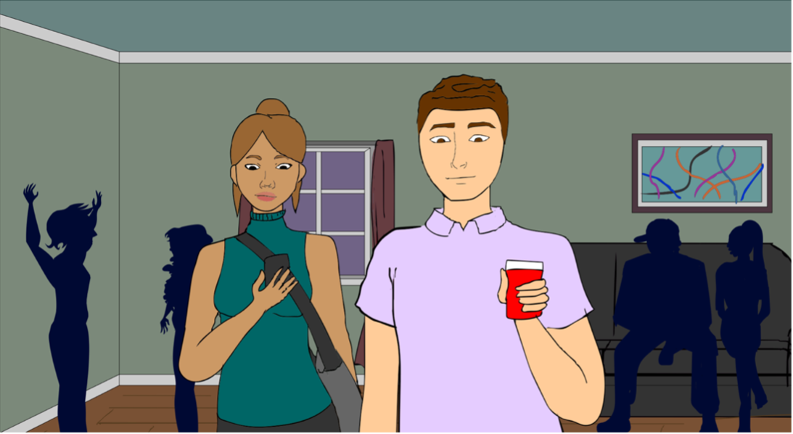
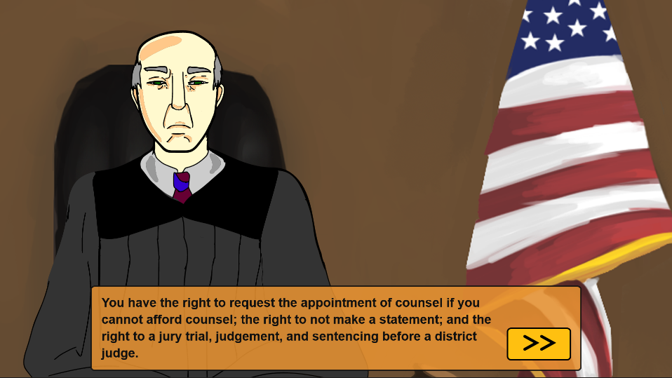
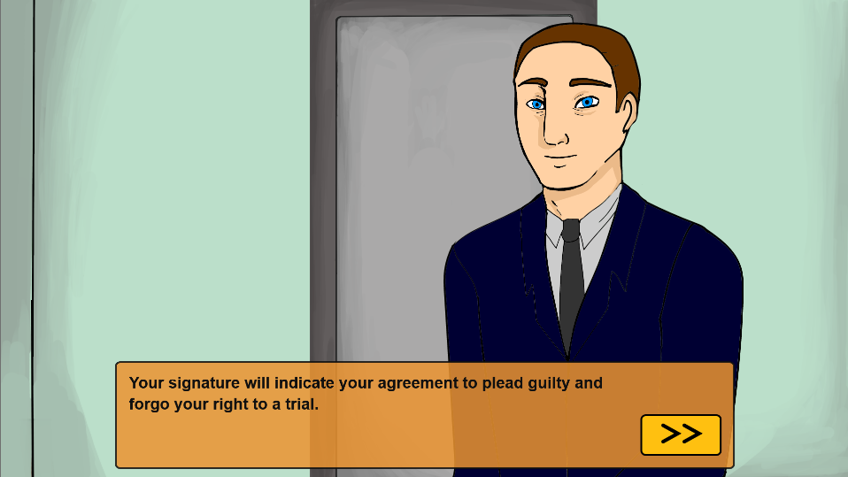
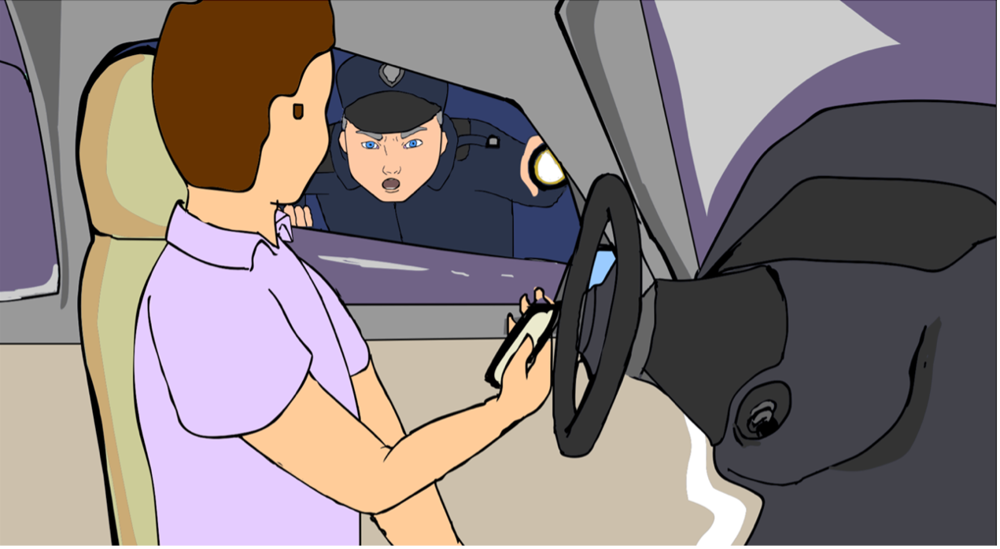
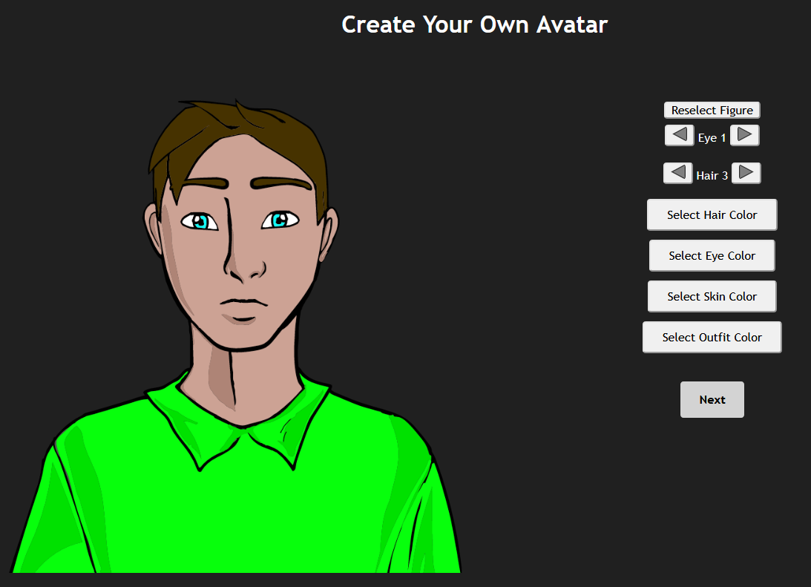
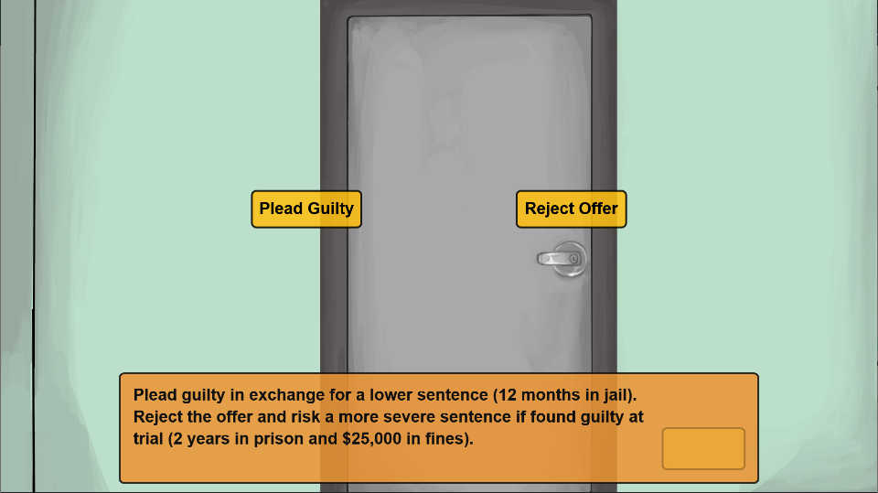
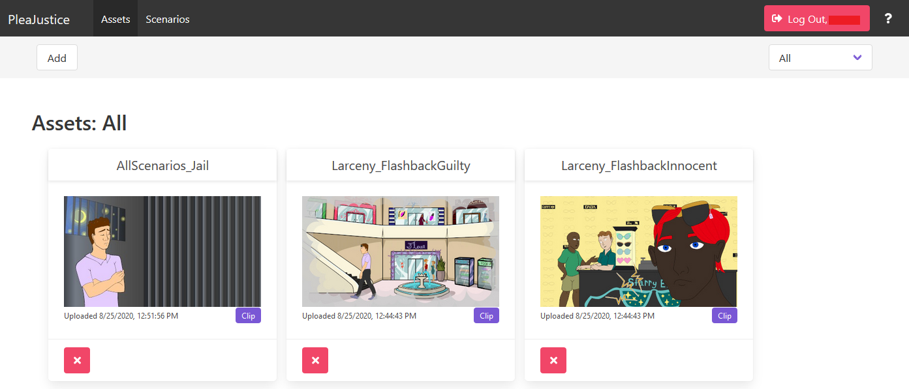

---
# Feel free to add content and custom Front Matter to this file.
# To modify the layout, see https://jekyllrb.com/docs/themes/#overriding-theme-defaults

layout: home
nav_order: 1
---

<div align="center">
  <h1>The PleaJustice Project</h1>
</div>

The Plea Justice Project provides an interactive simulation of legal procedures (it was originally designed to simulate the plea bargaining process specifically), offering an alternative to existing paradigms in legal decision-making research (e.g., vignettes/narratives, high-stakes deception studies; Redlich et al., 2017; Wilford et al., 2019).

Participants are presented with animated scenarios in which they are represented by a customizable avatar. These scenarios incorporate animated clips, dynamic actors (i.e., law enforcment officer, judge, attorneys) and a variety of backgrounds to increase the participant's immersion in the study. 

This simulation can be integrated with the Qualtrics survey platform and features a graphical configuration tool for researchers.
<details>
<summary><a href="https://demo.pleajustice.org">Click here for a demo</a> of the plea simulation.</summary>
The link will bring you to the <i>Researcher's Preview</i> page on which you may select one of the two existing scenarios (<i>Hit and Run</i> or <i>Shoplifting</i>), variables such as the participant's first name, and other configuration options. The right-hand side of the page provides a sample of the different experimental conditions a participant could be assigned to and the variables manipulated: guilt status, sentencing duration (if found guilty), and the probability of conviction. This demo (and its experimental parameters) represents one of the first published studies using the simulation (Wilford, Sutherland et al., 2021).

It is recommended to turn on the "Avatar Customization" feature located on the same Preview Simulation page for the full immersive experience.
</details>

***

<div style="display: flex; flex-direction: column; width: 100%; align-items: center;">
<p style="text-align: center;"><b><i>A demonstration of an interactive simulation of legal procedures.</i> <br> Virtual workshop co-sponsored by Law and Human Behavior and the American Psychology-Law Society (Division 41 of APA) </b></p>
<iframe width="560" height="315" src="https://www.youtube.com/embed/RleYRcLIwjQ" title="YouTube video player" frameborder="0" allow="accelerometer; autoplay; clipboard-write; encrypted-media; gyroscope; picture-in-picture" allowfullscreen></iframe>
</div>

***

## Features

### Animation & Dialogue

Participants are presented with a dynamic story composed of video clips and dialogue with legal actors. The participant experiences parts of the simulation in the third person (in which they are represented by an avatar) and in the first person.

|  |  |  |

One of three unique scenarios is depicted - one in which the participant-avatar is leaving a parking lot; one in which the participant-avatar is browsing for a pair of sunglasses at a retail store; one in which the participant-avatar is at a party with a friend. These animated sequences provide context to the participants, illustrating plausible series of events that lead them to be charged with a hit-and-run, theft, or drug possession (respectively).

|  |  |  |

All sequences can easily culminate in a variety of events, including receiving a summons to appear in court, appearing before a judge (with a prosecutor presenting charges), and being interrogated by a law enforcement officer. For guilty plea studies specifically, these events can culminate with participant-avatars receiving a plea offer (typically from a defense attorney).

Participants navigate the simulation by clicking through interactions with animated actors (i.e., sprites). As the simulation progresses, they learn more about the incident and the context of the accusation (e.g., guilt status, evidence).


### Customizable Avatars

Participants may customize an avatar to represent him or her in the simulation, providing personal depth to the story.

<p align="center">

</p>

Controls are provided to select among body types, eye shapes, and hairstyles. The colors of the skin, eyes, hair, and outfit of the participant-avatar are also customizable.

### Qualtrics Integration and In-Simulation Prompts

This simulation is designed for integration with Qualtrics. Participants may be routed from a survey to the simulation. Any data collected within the simulation (via "Question"s), is sent to Qualtrics when participants complete the simulation and are directed to a Qualtrics survey.

<p align="center">

</p>

Random assignment to different simulations and manipulation of the text presented in a simulation can be done using Qualtrics' branching logic, embedded data variables, and features of the survey flow.

### Configuration Console for Researchers

An online configuration tool makes it easy for researchers to design new simulation studies without the need for special software.

<p align="center">

</p>

With the console, researchers may write their own simulated narratives, manipulate variables, create prompts, access a library of animated assets and more. To access this interface, click the *Researcher Console* tab above or visit [researcher.pleajustice.org][reseacher-console-site].

***

## Software and Art Contributors

Interested in contributing to the development of this project or collaborating on related research? You can [contact the Principal Investigator here][contact-PI] if you have any questions, comments, concerns or inquiries regarding the project or the related research.

New developers, please read through _all_ of the documentation on this site. The project is written in vanilla JavaScript and the animated assets are created in _Adobe Animate_. You may find further technical docmentation in the project repositories.

### Software Licensing
This project is distributed under [GNU GPLv3][licensing].

```
    Plea Bargain Simulation
    Copyright (C) 2021 The Plea Justice Project

    This program is free software: you can redistribute it and/or modify
    it under the terms of the GNU General Public License as published by
    the Free Software Foundation, either version 3 of the License, or
    (at your option) any later version.

    This program is distributed in the hope that it will be useful,
    but WITHOUT ANY WARRANTY; without even the implied warranty of
    MERCHANTABILITY or FITNESS FOR A PARTICULAR PURPOSE.  See the
    GNU General Public License for more details.

    You should have received a copy of the GNU General Public License
    along with this program.  If not, see <https://www.gnu.org/licenses/>.
```

***

## Related Publications
* 08/2021 - [*Law and Human Behavior*][article-2]: Guilt status influences plea outcomes beyond the shadow-of-the-trial in an interactive simulation of legal procedures
* 06/2021 - [*Journal of Experimental Criminology*][article-3]: Innocence in the shadow of COVID-19: Plea decision-making during a pandemic
* 11/2022 - [*Journal of Experimental Psychology*][article-4]: Terms and conditions apply: the effect of probation length and obligation disclosure on true and false guilty pleas
* 05/2023 - [*Criminal Justice and Behavior*][article-5]: "Reject the Offer": The asymmetric impact of defense attorneys' plea recommendations
* 06/2023 - [*Journal of Experimental Criminology*][article-6]: Confession evidence results in more true and false guilty pleas than eyewitness evidence
* 03/2025 - [*Law and Human Behavior*][article-7]: The psychological allure of Alford: does wanting to appear innocent put innocents at risk?
* 10/2025 - [*Behavioral Sciences*][article-8]: Understanding attorneys' plea advice: the role of defendant guilt and trial penalties
* 4/2026 – [*Applied Cognitive Psychology*][article-9]: Emphasizing Miranda’s importance promotes procedurally just decisions


<!--- below are 1. comments that address long-term changes that need to be made to this page and 2. reference variables that represent external links -->

["Installing; Note: The current implementation"]: <> (be sure to update the method for implementing it on a remote server)
["Recording responses in Qualtrics"]: <> (add a link documentation on data cleaner)
["Licensing implementation"]: <> (will need to look into implementation on licensing; an About page)

[simulation-demo]: https://demo2.pleajustice.org/
[reseacher-console-site]:https://researcher.pleajustice.org/
[git]: https://git-scm.com/downloads
[python]: https://www.python.org/
[http-server]: https://www.npmjs.com/package/http-server
[contact-PI]: https://mikowilford.wixsite.com/website-1
[github-page]: https://github.com/Plea-Justice/pleabargain-simulation
[licensing]: https://github.com/Plea-Justice/pleabargain-simulation/blob/master/LICENSE.txt
[article-1]: https://www.psychologytoday.com/intl/blog/injustice-system/202110/how-could-video-game-improve-the-justice-system
[article-2]: https://psycnet.apa.org/record/2021-90818-001
[article-3]: https://psycnet.apa.org/record/2021-55856-001
[article-4]: https://link.springer.com/article/10.1007/s11292-022-09543-9
[article-5]: https://journals.sagepub.com/doi/full/10.1177/00938548231172515
[article-6]: https://psycnet.apa.org/record/2023-88538-001
[article-7]: https://psycnet.apa.org/record/2025-99117-001
[article-8]: https://pmc.ncbi.nlm.nih.gov/articles/PMC12649738/
[article-9]: https://onlinelibrary.wiley.com/doi/10.1002/acp.70196
