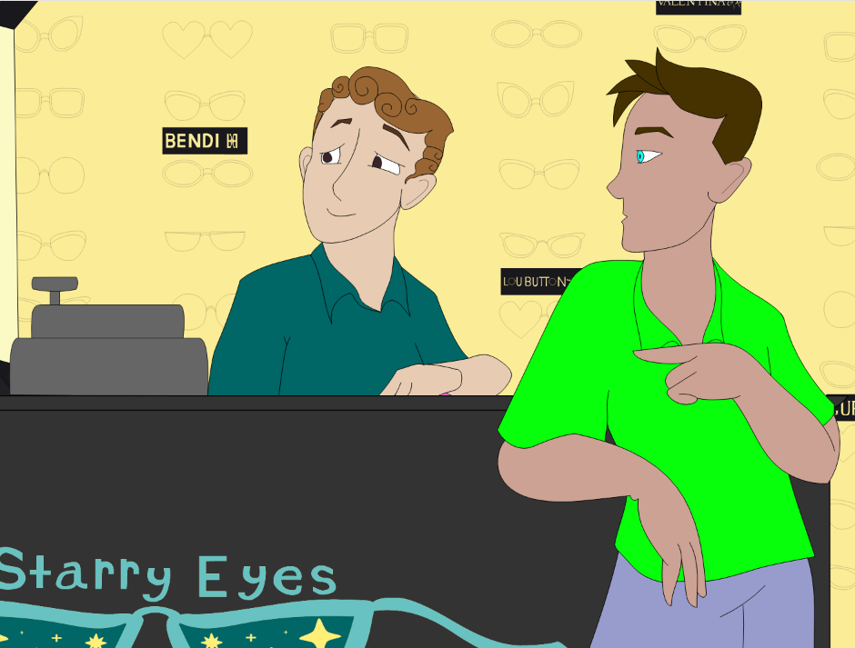
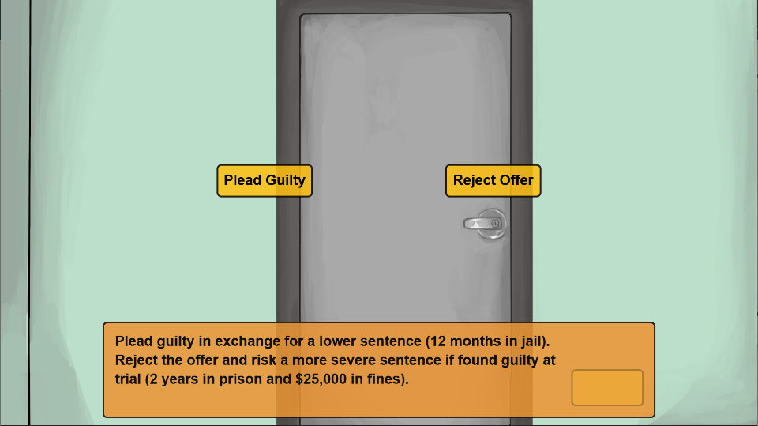

---
# Feel free to add content and custom Front Matter to this file.
# To modify the layout, see https://jekyllrb.com/docs/themes/#overriding-theme-defaults

layout: home
nav_order: 1
---

# The Plea Justice Project
The Plea Justice Project provides an interactive simulation of the plea bargaining processes, offering an alternative to existing paradigms in plea decision-making research such as vignettes and high-stakes deceptions.

Participants are presented with one of two animated scenarios in which they are represented by a customizable avatar. From there, the story can be developed with characters representing a prosecutor or the participant's defense attorney.

The plea simulation integrates with the Qualtrics survey platform and features a graphical configuration tool for researchers.
<details>
<summary><a href="https://demo.pleajustice.org">Click here for a demo</a> of the plea simulation.</summary>
The link will bring you to the <i>Researcher's Preview</i> page on which you may select one of the two existing scenarios (<i>Hit and Run</i> or <i>Shoplifting</i>), variables such as the participant's first name, and other configuration options. The right-hand side of the page provides a sample of the different experimental conditions a participant could be assigned to and the variables manipulated: guilt status, sentencing duration (if found guilty), and the probability of conviction.

It is recommended to turn on the Avatar Customization feature located on the same Preview Simulation page for the full immersive experience.
</details>

***

## Features

### Animation & Dialogue

Participants are presented with an animated story composed of video clips and interactions with legal actors such as a judge and several attorneys. The participant experiences parts of the simulation in the third person (where they are represented by an avatar) and in the first person.

|  |  |

One of two unique scenarios is depicted -- one in which the participant-avatar is driving home from a parking lot, and the other in which the participant-avatar is browsing for a pair of glasses at the mall. These animated sequences provide context to the participant as they illustrate a plausible series of events resulting in the participant-avatar being brought to court over accusations of either a hit-and-run or larceny.

|  |  |

Both sequences lead up to the avatar being summoned to court and given a plea offer. The participant navigates the simulation by clicking through interactions with other actors. As the simulation progresses, they learn more about the incident and their avatar's guilt status.

### Customizable Avatars

Participants may customize an avatar to represent him or her in the simulation, providing personal depth to the story.

<p align="center">

</p>

Controls are provided to select among body types, eye shapes, and hairstyles. The colors of the skin, eyes, hair, and outfit of the participant-avatar are also customizable.

### Qualtrics Integration and In-Simulation Prompts

The plea bargain simulation is designed to integrate with Qualtrics. Participants may be routed from a survey to the simulation. Any data collected within the simulation, such as through multiple-choice prompts, is sent back to Qualtrics when participants complete the simulation and return to the survey.

<p align="center">

</p>

Random assignment to different simulations and manipulation of the text presented in a simulation can be done using Qualtrics' branching logic, embedded data variables, and features of the survey flow.

### Configuration Console for Researchers

An online configuration tool makes it easy for researchers to design new simulation studies without the need for special software.

<p align="center">

</p>

With the console, researchers may write their own simulated narratives, manipulate variables, create prompts, access a library of animated assets and more. To access this interface, click the *Researcher Console* tab above or visit [researcher.pleajustice.org][reseacher-console-site].

***

## Software and Art Contributors

Interested in contributing to the development of this project or collaborating on related research? You can [contact the Principal Investigator here][contact-PI] if you have any questions, comments, concerns or inquiries regarding the project or the related research.

New developers, please read through _all_ of the documentation on this site. The project is written in vanilla JavaScript and the animated assets are created in _Adobe Animate_. You may find further technical docmentation in the project repositories.

### Software Licensing
This project is distributed under [GNU GPLv3][licensing].

```
    Plea Bargain Simulation
    Copyright (C) 2021 The Plea Justice Project

    This program is free software: you can redistribute it and/or modify
    it under the terms of the GNU General Public License as published by
    the Free Software Foundation, either version 3 of the License, or
    (at your option) any later version.

    This program is distributed in the hope that it will be useful,
    but WITHOUT ANY WARRANTY; without even the implied warranty of
    MERCHANTABILITY or FITNESS FOR A PARTICULAR PURPOSE.  See the
    GNU General Public License for more details.

    You should have received a copy of the GNU General Public License
    along with this program.  If not, see <https://www.gnu.org/licenses/>.
```

***

## Related Articles
* 06/04/2018 - [To Plead or Not to Plead][article-1]: Psychology and Art Faculty Team Up with Students on Plea Bargain Research Tool
* 02/26/2019 - [Why Do Innocent People Plead Guilty?][article-2]: UMass Lowell Researcher Wins NSF Grant to Find Answers

<!--- below are 1. comments that address long-term changes that need to be made to this page and 2. reference variables that represent external links -->

["Installing; Note: The current implementation"]: <> (be sure to update the method for implementing it on a remote server)
["Recording responses in Qualtrics"]: <> (add a link documentation on data cleaner)
["Licensing implementation"]: <> (will need to look into implementation on licensing; an About page)

[simulation-demo]: https://demo2.pleajustice.org/
[reseacher-console-site]:https://researcher.pleajustice.org/
[git]: https://git-scm.com/downloads
[python]: https://www.python.org/
[http-server]: https://www.npmjs.com/package/http-server
[contact-PI]: https://mikowilford.wixsite.com/website-1
[github-page]: https://github.com/Plea-Justice/pleabargain-simulation
[licensing]: https://github.com/Plea-Justice/pleabargain-simulation/blob/master/LICENSE.txt
[article-1]: https://www.uml.edu/news/stories/2018/pleabargains.aspx
[article-2]: https://www.uml.edu/news/press-releases/2019/wilfordresearch022619.aspx
