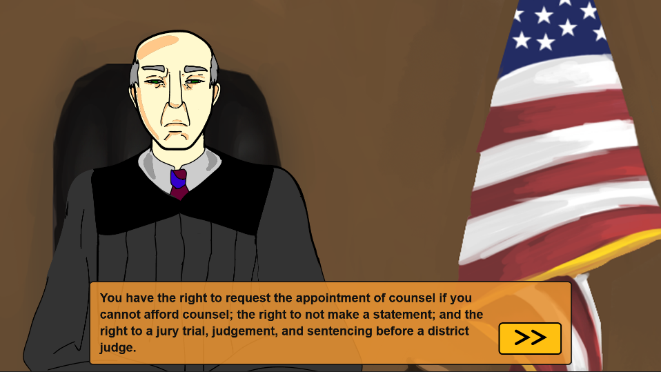

---
# Feel free to add content and custom Front Matter to this file.
# To modify the layout, see https://jekyllrb.com/docs/themes/#overriding-theme-defaults

layout: home
nav_order: 1
---

# The Plea Justice Project
The Plea Justice Project provides an interactive simulation of the plea bargaining processes, offering an alternative to existing paradigms in plea decision-making research such as vignettes and high-stakes deceptions.

Participants are presented with one of two animated scenarios in which they are represented by a customizable avatar. From there, the story can be developed with characters representing a prosecutor or the participant's defense attorney.

The plea simulation integrates with the Qualtrics survey platform and features a graphical configuration tool for researchers.

<a href="https://demo.pleajustice.org">Click here for a demo</a> of the plea simulation.

The link will bring you to the <i>Researcher's Preview</i> page on which you may select one of the two existing scenarios (<i>Hit and Run</i> or <i>Shoplifting</i>), variables such as the participant's first name, and other configuration options. The right-hand side of the page provides a sample of the different experimental conditions a participant could be assigned to and the variables manipulated: guilt status, sentencing duration (if found guilty), and the probability of conviction.

It is recommended to turn on the Avatar Customization feature located on the same Preview Simulation page for the full immersive experience.

***

### Features

**Animation & Dialogue**

|  |  |

The user is presented with one of two unique scenarios featuring the customized avatar the user created -- one with the avatar driving and the other with the avatar browsing for a pair of glasses at the mall. These animated sequences provide context to the user as they illustrate  sequences of events that occur before the avatar receives a summons and is ordered to appear in court.

|  |  |

Both sequences lead up to the avatar being summoned to court and asked to either accept a plea offer and plead guilty, or reject the offer and go to trial. The user navigates the simulation by clicking the “>>” button as it appears (when the dialogue has stopped); as the simulation progresses, they learn more about the incident surrounding their avatar (e.g., whether they are innocent or guilty of the crime to which they are accused).

**Avatar Customization**

Using the interface shown above, users are able to customize an avatar to represent them in the simulation. Controls are provided to select figure types, eye types, or hair styles, as well as selecting a color for the hair, eyes, skin, and shirt.

**Modifiable Values & Recording Responses in Qualtrics**

The simulation concludes by offering the user the option to either plead guilty and accept the plea offer or reject it. The option the user selects, alongside other variables scattered throughout the simulation, are then saved and passed as parameters into Qualtrics. Although it is separate from this software, the platform contains features to incorporate conditional logic in the survey flow based on variables expressed in the simulation (e.g. *guilt status*, plea offer *type*, sentencing *duration*).

**Researcher Console**

Another facet of the Plea Justice project is to providing a platform to allow other researchers to expand upon the existing project scope. The Researcher Console is a web interface for other researchers to write their own narratives, configure their own simulations, test their own variables, and more. To access this interface, click the *Researcher Console* tab above or visit [researcher.pleajustice.org][reseacher-console-site].

### Installing

> **Note**: *The current implementation of the project has the source and asset files deployed onto a server, which allows those with server access to run the simulation without downloading any of the files. Instructions on how to set up a remote web server for this project will be coming soon.*

To run the simulation on your own local machine, download the source code by cloning the GitHub repository through Command Line with the `git` command,

    git clone https://github.com/Plea-Justice/pleabargain-simulation.git

or download and extract the zip file on the desktop site. Once the files are on your machine, create a local web server by way of navigating to the folder of the project in the terminal and typing either `python3 -m http.server` or `http-server`.

* To download Git, [visit the Git downloads page][git] and find the download that corresponds to your operating system.
* To download Python, [visit the Python homepage][python] and download the release that corresponds to your operating system.
* To download http-server, [here is the link to the http-server README][http-server] on the NPM (Node Package Manager) webpage.

***

## Contribution

New developers, please read through _all_ of the documentation on this site.

Interested in contributing to the development of this project or collaborating on related research? You can [contact the Principal Investigator here][contact-PI] if you have any questions, comments, concerns or inquiries regarding the project or the related research.

The project is written in vanilla JavaScript and the animated assets are created in _Adobe Animate_.

Before contributing to the software, take a look at [how the project is made](/internal/dev/software-architecture-layout) or the [source code][github-page] and see if there is an area in need of improvements.

### License
This project is licensed using [GNU GPLv3][licensing].

***

## Related Articles
* 06/04/2018 - [To Plead or Not to Plead][article-1]: Psychology and Art Faculty Team Up with Students on Plea Bargain Research Tool
* 02/26/2019 - [Why Do Innocent People Plead Guilty?][article-2]: UMass Lowell Researcher Wins NSF Grant to Find Answers

<!--- below are 1. comments that address long-term changes that need to be made to this page and 2. reference variables that represent external links -->

["Installing; Note: The current implementation"]: <> (be sure to update the method for implementing it on a remote server)
["Recording responses in Qualtrics"]: <> (add a link documentation on data cleaner)
["Licensing implementation"]: <> (will need to look into implementation on licensing; an About page)

[simulation-demo]: https://demo2.pleajustice.org/
[reseacher-console-site]:https://researcher.pleajustice.org/
[git]: https://git-scm.com/downloads
[python]: https://www.python.org/
[http-server]: https://www.npmjs.com/package/http-server
[contact-PI]: https://mikowilford.wixsite.com/website-1
[github-page]: https://github.com/Plea-Justice/pleabargain-simulation
[licensing]: https://github.com/Plea-Justice/pleabargain-simulation/blob/master/LICENSE.txt
[article-1]: https://www.uml.edu/news/stories/2018/pleabargains.aspx
[article-2]: https://www.uml.edu/news/press-releases/2019/wilfordresearch022619.aspx
